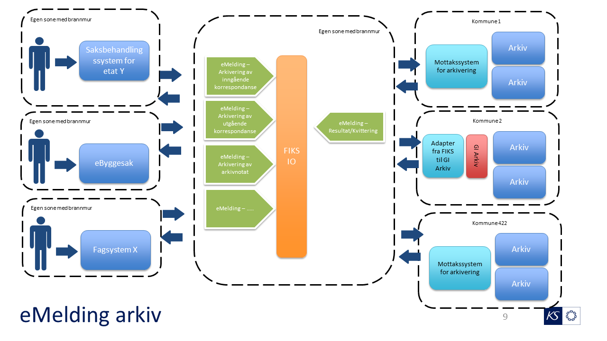

# fiks.io.fagsystem.arkiv.sample

## Oppsett av prosjekt

## Bakgrunn
Dette er et forarbeid til arbeidsoppgaver i fornying av geointegrasjon for å vise muligheter og eksempler på FIKS IO integrasjon.
Flyten i meldinger baserer seg på brukstilfeller i GI-Arkiv og foreslåtte tiltak i [Sluttrapport fra arbeidsgruppe: Arkitektur og strategi](http://geointegrasjon.no/sluttrapport-fra-arbeidsgruppe-arkitektur-og-strategi/). 

Strategirapporten foreslår en inndeling av meldinger basert på erfaringer siden 2012 med GI-Arkiv og spesielt [veilederen for arkiv integrasjon](http://geointegrasjon.no/arkiv/veileder-arkiv/veileder-arkiv-for-leverandor-av-klientsystem/veileder-for-gi-arkiv-integrasjon/) som ble etablert i 2018.

- Etablere eMelding for forenklet arkivering (minimum av domenekunnskap om arkiv)
- Etablere eMelding for arkivering som er bakoverkompatibel med GI Arkiv, evt med adapter
- Etablere eMelding for arkivering med utvidet funksjonalitet

 ## Oppsett i FIKS Integrasjon
TBC

## FIKS IO meldingsprotokoll - Forenklet arkivering
- For fagsystemer så må meldingsprotokoll no.geointegrasjon.arkiv.oppdatering.forenklet støttes som avsender
- For arkivsystem så må meldingsprotokoll no.geointegrasjon.arkiv.oppdatering.forenklet støttes som mottaker

### Meldinger fra fagsystem til arkiv
- Opprette ny saksmappe i arkivet
- Opprette en ny innkommende journalpost
- Opprette en ny utgående journalpost
- Opprette arkivnotat
- TBC

## FIKS IO meldingsprotokoll - GI bakoverkompatibel arkivering
- For fagsystemer så må meldingsprotokoll no.geointegrasjon.arkiv.oppdatering.basis støttes som avsender
- For arkivsystem så må meldingsprotokoll no.geointegrasjon.arkiv.oppdatering.basis støttes som mottaker

## FIKS IO meldingsprotokoll - arkivering utvidet funksjonalitet
- For fagsystemer så må meldingsprotokoll no.geointegrasjon.arkiv.oppdatering.utvidet støttes som avsender
- For arkivsystem så må meldingsprotokoll no.geointegrasjon.arkiv.oppdatering.utvidet støttes som mottaker
- Denne kan feks benytte Difi eFormidling sin [arkivmelding](https://difi.github.io/eformidling/message.html#arkivmelding)
