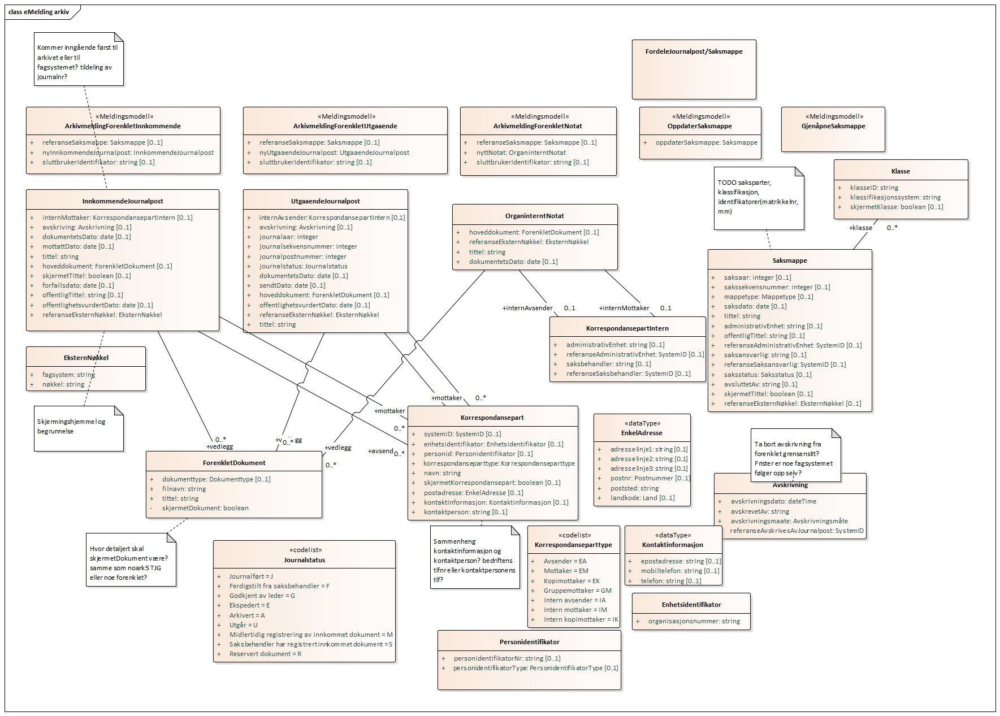

# fiks.io.fagsystem.arkiv.sample

## Oppsett av prosjekt

## Bakgrunn
Dette er et forarbeid til arbeidsoppgaver i fornying av geointegrasjon for å vise muligheter og eksempler på FIKS IO integrasjon.
Flyten i meldinger baserer seg på brukstilfeller i GI-Arkiv og foreslåtte tiltak i [Sluttrapport fra arbeidsgruppe: Arkitektur og strategi](http://geointegrasjon.no/sluttrapport-fra-arbeidsgruppe-arkitektur-og-strategi/). 

Strategirapporten foreslår en inndeling av meldinger basert på erfaringer siden 2012 med GI-Arkiv og spesielt [veilederen for arkiv integrasjon](http://geointegrasjon.no/arkiv/veileder-arkiv/veileder-arkiv-for-leverandor-av-klientsystem/veileder-for-gi-arkiv-integrasjon/) som ble etablert i 2018.

- Etablere eMelding for forenklet arkivering (minimum av domenekunnskap om arkiv)
- Etablere eMelding for arkivering som er bakoverkompatibel med GI Arkiv, evt med adapter
- Etablere eMelding for arkivering med utvidet funksjonalitet


 ## Oppsett i FIKS Integrasjon
TBC

## FIKS IO meldingsprotokoll - Forenklet arkivering
- For fagsystemer så må meldingsprotokoll no.geointegrasjon.arkiv.oppdatering.forenklet støttes som avsender
- For arkivsystem så må meldingsprotokoll no.geointegrasjon.arkiv.oppdatering.forenklet støttes som mottaker


### Meldinger fra fagsystem til arkiv
- Opprette ny saksmappe i arkivet
- Opprette en ny innkommende journalpost
Eksempel
```csharp
//Fagsystem definerer ønsket struktur
            ArkivmeldingForenkletInnkommende inng = new ArkivmeldingForenkletInnkommende();
            inng.sluttbrukerIdentifikator = "Fagsystemets brukerid";

            inng.nyInnkommendeJournalpost = new InnkommendeJournalpost();
            inng.nyInnkommendeJournalpost.referanseEksternNøkkel = new EksternNøkkel();
            inng.nyInnkommendeJournalpost.referanseEksternNøkkel.fagsystem = "Fagsystem X";
            inng.nyInnkommendeJournalpost.referanseEksternNøkkel.nøkkel = Guid.NewGuid().ToString();

            inng.nyInnkommendeJournalpost.tittel = "Bestilling av oppmålingsforretning ...";
            inng.nyInnkommendeJournalpost.mottattDato = DateTime.Today;
            inng.nyInnkommendeJournalpost.dokumentetsDato = DateTime.Today.AddDays(-2);
            inng.nyInnkommendeJournalpost.offentlighetsvurdertDato = DateTime.Today;

            inng.nyInnkommendeJournalpost.internMottaker = new List<KorrespondansepartIntern>();
            inng.nyInnkommendeJournalpost.internMottaker.Add(new KorrespondansepartIntern() { administrativEnhet = "Oppmålingsetaten" });

            inng.nyInnkommendeJournalpost.mottaker = new List<Korrespondansepart>();
            inng.nyInnkommendeJournalpost.mottaker.Add(new Korrespondansepart() { navn = "Test kommune", enhetsidentifikator = new Enhetsidentifikator() { organisasjonsnummer= "123456789" }, postadresse = new EnkelAdresse() { adresselinje1 = "Oppmålingsetaten", adresselinje2 = "Rådhusgate 1", postnr = "3801", poststed = "Bø" } });


            inng.nyInnkommendeJournalpost.avsender = new List<Korrespondansepart>();
            inng.nyInnkommendeJournalpost.avsender.Add(new Korrespondansepart() { navn = "Anita Avsender", postadresse = new EnkelAdresse() { adresselinje1 = "Gate 1", postnr = "3801", poststed = "Bø" } });


            inng.nyInnkommendeJournalpost.hoveddokument = new ForenkletDokument();
            inng.nyInnkommendeJournalpost.hoveddokument.tittel = "Rekvisisjon av oppmålingsforretning";
            inng.nyInnkommendeJournalpost.hoveddokument.filnavn = "rekvisisjon.pdf";

            inng.nyInnkommendeJournalpost.vedlegg = new List<ForenkletDokument>();
            var vedlegg1 = new ForenkletDokument();
            vedlegg1.tittel = "Vedlegg 1";
            vedlegg1.filnavn = "vedlegg.pdf";
            inng.nyInnkommendeJournalpost.vedlegg.Add(vedlegg1);

            //osv...

            //Konverterer til arkivmelding xml
            var arkivmelding = Arkivintegrasjon.ConvertForenkletInnkommendeToArkivmelding(inng);
            string payload = Arkivintegrasjon.Serialize(arkivmelding);

            //Lager FIKS IO melding
            List<IPayload> payloads = new List<IPayload>();
            payloads.Add(new StringPayload(payload, "innkommendejournalpost.xml"));
            payloads.Add(new FilePayload(@"samples\rekvisisjon.pdf"));
            payloads.Add(new FilePayload(@"samples\vedlegg.pdf"));

            //Sender til FIKS IO (arkiv løsning)
            var msg = client.Send(messageRequest, payloads).Result;
```
Eksempel på innkommendejournalpost.xml
```xml
<?xml version="1.0" encoding="utf-16"?>
<arkivmelding xmlns:xsi="http://www.w3.org/2001/XMLSchema-instance" xmlns:xsd="http://www.w3.org/2001/XMLSchema" xmlns="http://www.arkivverket.no/standarder/noark5/arkivmelding">
  <system>Fagsystem X</system>
  <meldingId>b6a2c359-0a43-46c0-b26a-606a0fe3464a</meldingId>
  <tidspunkt>2020-06-02T13:22:52.8745023+02:00</tidspunkt>
  <antallFiler>2</antallFiler>
  <registrering xsi:type="journalpost">
    <part>
      <partNavn>Test kommune</partNavn>
      <partRolle>EM</partRolle>
      <postadresse>Oppmålingsetaten</postadresse>
      <postadresse>Rådhusgate 1</postadresse>
      <postnummer>3801</postnummer>
      <poststed>Bø</poststed>
    </part>
    <part>
      <partNavn>Anita Avsender</partNavn>
      <partRolle>EA</partRolle>
      <postadresse>Gate 1</postadresse>
      <postnummer>3801</postnummer>
      <poststed>Bø</poststed>
    </part>
    <part>
      <partNavn>Oppmålingsetaten</partNavn>
      <partRolle>IM</partRolle>
    </part>
    <dokumentbeskrivelse>
      <dokumentstatus>F</dokumentstatus>
      <tittel>Rekvisisjon av oppmålingsforretning</tittel>
      <tilknyttetRegistreringSom>H</tilknyttetRegistreringSom>
      <dokumentobjekt>
        <referanseDokumentfil>rekvisisjon.pdf</referanseDokumentfil>
      </dokumentobjekt>
    </dokumentbeskrivelse>
    <dokumentbeskrivelse>
      <dokumentstatus>F</dokumentstatus>
      <tittel>Vedlegg 1</tittel>
      <tilknyttetRegistreringSom>V</tilknyttetRegistreringSom>
      <dokumentobjekt>
        <referanseDokumentfil>vedlegg.pdf</referanseDokumentfil>
      </dokumentobjekt>
    </dokumentbeskrivelse>
    <tittel>Bestilling av oppmålingsforretning ...</tittel>
    <journalposttype>I</journalposttype>
    <dokumentetsDato>2020-05-31</dokumentetsDato>
    <mottattDato>2020-06-02T00:00:00+02:00</mottattDato>
    <offentlighetsvurdertDato>2020-06-02</offentlighetsvurdertDato>
  </registrering>
</arkivmelding>
```
- Opprette en ny utgående journalpost [no.geointegrasjon.arkiv.oppdatering.forenklet.nyutgaaendejournalpost.v2](ks.fiks.io.fagsystem.arkiv.sample/schema/no.geointegrasjon.arkiv.oppdatering.forenklet.arkivmeldingforenklet.v2.schema.json) [Eksempel json](ks.fiks.io.fagsystem.arkiv.sample/samples/utgaaendejournalpost.json)
Eksempel
```csharp
            //Fagsystem definerer ønsket struktur
            ArkivmeldingForenkletUtgaaende utg = new ArkivmeldingForenkletUtgaaende();
            utg.sluttbrukerIdentifikator = "Fagsystemets brukerid";
            utg.nyUtgaaendeJournalpost = new UtgaaendeJournalpost();
            utg.nyUtgaaendeJournalpost.referanseEksternNøkkel = new EksternNøkkel();
            utg.nyUtgaaendeJournalpost.referanseEksternNøkkel.fagsystem = "Fagsystem X";
            utg.nyUtgaaendeJournalpost.referanseEksternNøkkel.nøkkel = Guid.NewGuid().ToString();

            utg.nyUtgaaendeJournalpost.tittel = "Tillatelse til ...";
            utg.nyUtgaaendeJournalpost.hoveddokument = new ForenkletDokument();
            utg.nyUtgaaendeJournalpost.hoveddokument.tittel = "Vedtak om tillatelse til ...";
            utg.nyUtgaaendeJournalpost.hoveddokument.filnavn = "vedtak.pdf";

            utg.nyUtgaaendeJournalpost.vedlegg = new List<ForenkletDokument>();
            var vedlegg1 = new ForenkletDokument();
            vedlegg1.tittel = "Vedlegg 1";
            vedlegg1.filnavn = "vedlegg.pdf";
            utg.nyUtgaaendeJournalpost.vedlegg.Add(vedlegg1);

            //osv...

            //Konverterer til arkivmelding xml
            var arkivmelding = Arkivintegrasjon.ConvertForenkletUtgaaendeToArkivmelding(utg);
            string payload = Arkivintegrasjon.Serialize(arkivmelding);

            //Lager FIKS IO melding
            List<IPayload> payloads = new List<IPayload>();
            payloads.Add(new StringPayload(payload, "utgaaendejournalpost.xml"));
            payloads.Add(new FilePayload(@"samples\vedtak.pdf"));
            payloads.Add(new FilePayload(@"samples\vedlegg.pdf"));

            //Sender til FIKS IO (arkiv løsning)
            var msg = client.Send(messageRequest, payloads).Result;

```
Eksempel på utgaaendejournalpost.xml
```xml
<?xml version="1.0" encoding="utf-16"?>
<arkivmelding xmlns:xsi="http://www.w3.org/2001/XMLSchema-instance" xmlns:xsd="http://www.w3.org/2001/XMLSchema" xmlns="http://www.arkivverket.no/standarder/noark5/arkivmelding">
  <system>Fagsystem X</system>
  <meldingId>2f1c878e-6baa-43ba-aa48-f61130f47668</meldingId>
  <tidspunkt>2020-05-28T13:23:24.7573189+02:00</tidspunkt>
  <antallFiler>2</antallFiler>
  <registrering xsi:type="journalpost">
    <dokumentbeskrivelse>
      <dokumentstatus>F</dokumentstatus>
      <tittel>Vedtak om tillatelse til ...</tittel>
      <tilknyttetRegistreringSom>H</tilknyttetRegistreringSom>
      <dokumentobjekt>
        <referanseDokumentfil>vedtak.pdf</referanseDokumentfil>
      </dokumentobjekt>
    </dokumentbeskrivelse>
    <dokumentbeskrivelse>
      <dokumentstatus>F</dokumentstatus>
      <tittel>Vedlegg 1</tittel>
      <tilknyttetRegistreringSom>V</tilknyttetRegistreringSom>
      <dokumentobjekt>
        <referanseDokumentfil>vedlegg.pdf</referanseDokumentfil>
      </dokumentobjekt>
    </dokumentbeskrivelse>
    <tittel>Tillatelse til ...</tittel>
    <journalposttype>U</journalposttype>
    <dokumentetsDato>0001-01-01</dokumentetsDato>
    <sendtDato>0001-01-01T00:00:00</sendtDato>
    <offentlighetsvurdertDato>0001-01-01</offentlighetsvurdertDato>
  </registrering>
</arkivmelding>
```
- Opprette arkivnotat
- TBC

## FIKS IO meldingsprotokoll - GI bakoverkompatibel arkivering
- For fagsystemer så må meldingsprotokoll no.geointegrasjon.arkiv.oppdatering.basis støttes som avsender
- For arkivsystem så må meldingsprotokoll no.geointegrasjon.arkiv.oppdatering.basis støttes som mottaker

## FIKS IO meldingsprotokoll - arkivering utvidet funksjonalitet
- For fagsystemer så må meldingsprotokoll no.geointegrasjon.arkiv.oppdatering.utvidet støttes som avsender
- For arkivsystem så må meldingsprotokoll no.geointegrasjon.arkiv.oppdatering.utvidet støttes som mottaker
- Denne kan feks benytte Difi eFormidling sin [arkivmelding](https://difi.github.io/felleslosninger/eformidling_nm_arkivmeldingen.html)
